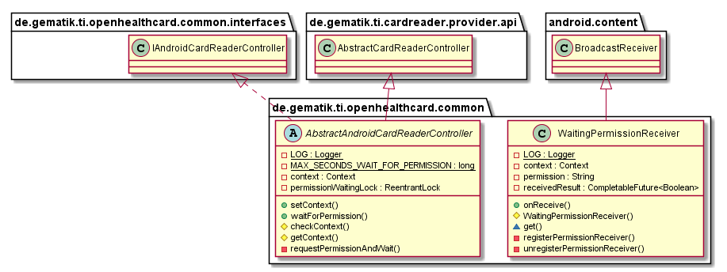
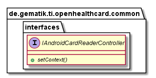

# OpenHealthCard-Common Android Library

## Introduction

This part describes the functionality and usability of android common library

## API Documentation

Generated API docs are available at <https://gematik.github.io/ref-OpenHealthCard-Common-Android>.

## License

Licensed under the [Apache License, Version 2.0](https://www.apache.org/licenses/LICENSE-2.0).

## Overview

This Library contains Controller to inject Android Context to CardReader Provider. For that
extends this Library the cardreader.provider.api functionality for Android. Furthermore
Controller to request Permissions from Provider to handle e.g. card reader.

  

### AndroidCardReaderController

This class is an android specific extension of [AbstractCardReaderController](#crpapi_cardreadercontroller) from package de.gematik.ti.cardreader.provider.api.
The additional functionalities are android context handling and permissions requests, necessary for android card reader provider.

  

  

## Getting Started

### Build setup

To use OpenHealthCard Common library in a project, you need just to include following dependency:

**Gradle dependency settings to use OpenHealthCard Common library.**

    dependencies {
        implementation group: 'de.gematik.ti', name: 'openhealthcard.common', version: '1.1.2'
    }

**Maven dependency settings to use OpenHealthCard Common library.**

    <dependencies>
        <dependency>
            <groupId>de.gematik.ti</groupId>
            <artifactId>openhealthcard.common</artifactId>
            <version>1.1.2</version>
        </dependency>
    </dependencies>
